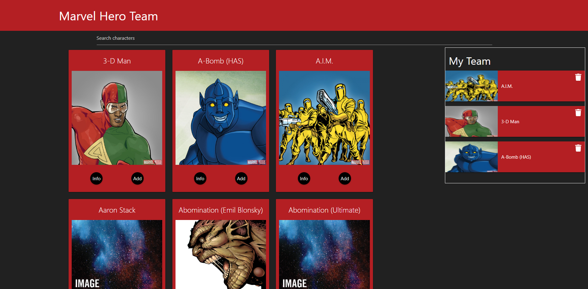

<!-- PROJECT LOGO -->

  <h1 align="center">Marvel Heroes Team</h1>

  <h3 align="center">
   A theme builder application based on Marvel comics
  </h3>
  
 
 ### Click here for live demo   <a href="https://marvelteambuilder.netlify.app">Marvel Heroes Team</a>

<!-- ABOUT THE PROJECT -->

## About The Project:-

On the homepage the user can see all the heroes available and add them to your team or read more information on them

On the character page the user can see all the information relevant to that character

By clicking on each comic a modal will pop up giving the user all the information about that comic

Modal previewing all information

#### The common funtionalities are:-

- The user can see all characters available in database and add them to their team
- The user can see the detailed description of the selected character
- The user can search all the characters available in database

I'm using [Marvel API ](https://developer.marvel.com) to get characters.

##### Credit: Marvel API

### Built With

- #### React
- #### Materialize
- #### Marvel API

### Key concepts:

- #### React components
- #### React state and props
- #### React hooks
- #### Materialize CSS
- #### Fetching data from an API
- #### Handling events
- #### String manipulation
- #### Filtering data
- #### JavaScript Object Oriented Programming

<!-- GETTING STARTED -->

# Getting Started

This project was bootstrapped with [Create React App](https://github.com/facebook/create-react-app).

## Available Scripts

### To run project:-

### `npm start`

### To build project:-

### `npm run build`
